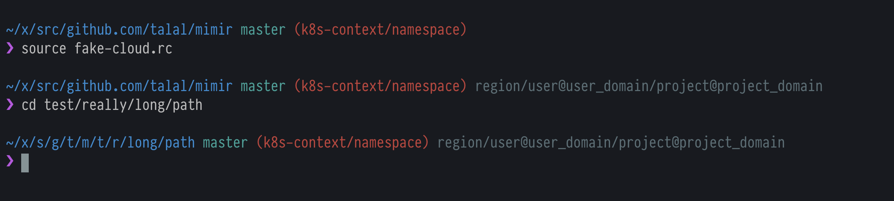

# Mímir

[](https://travis-ci.org/talal/mimir) [](https://goreportcard.com/report/github.com/talal/mimir)

Mímir is a fast and minimal Zsh prompt in [Go](https://golang.org). The look of Mímir is inspired by [Pure](https://github.com/sindresorhus/pure) and the functionality is inspired by [prettyprompt](https://github.com/majewsky/gofu#prettyprompt).



Features:
- Long directory paths are shortened (see screenshot above).
- Kubernetes context/namespace info is shown using the list of kubernetes configuration file(s) taken from `KUBECONFIG` environment variable.
- OpenStack cloud info is shown using the `CURRENT_OS_CLOUD` environment variable.

## Installation/Usage

Prerequisites:
- go

```
$ go get github.com/talal/mimir
$ cd $GOPATH/src/github.com/talal/mimir
$ make install
```

Add this to your `.zshrc` file:

```
autoload -Uz add-zsh-hook
prompt_mimir_cmd() { /usr/local/bin/mimir }
add-zsh-hook precmd prompt_mimir_cmd

prompt_symbol='❯'
PROMPT='%(?.%F{magenta}.%F{red})${prompt_symbol}%f '
```

## Credits

Most of the source code is borrowed from [prettyprompt](https://github.com/majewsky/gofu#prettyprompt).
